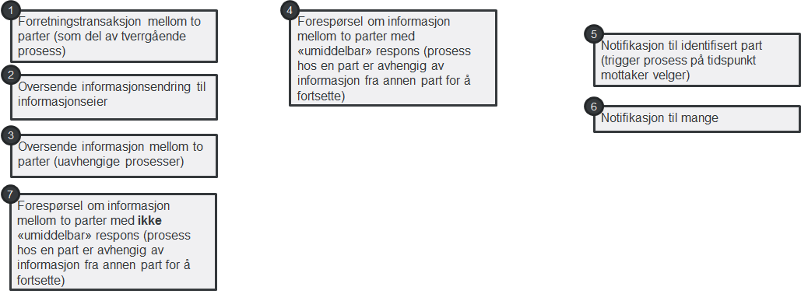
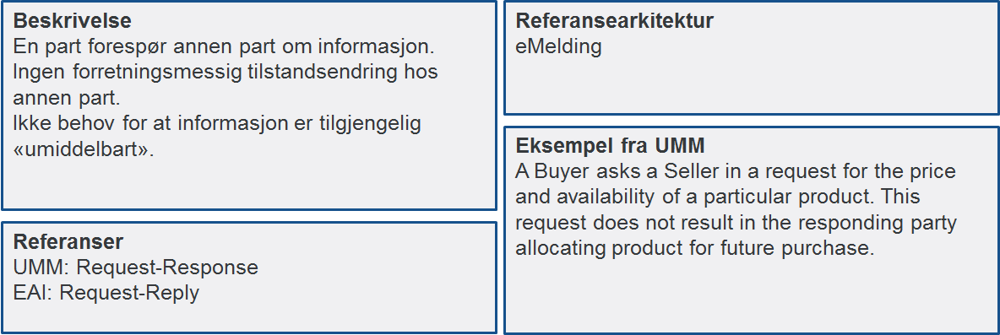

= Identifisering av samhandlingsmønstre

Digital samhandling mellom virksomheter kan utføres på et begrenset antall måter sett fra et forretningsståsted. Vi kaller dette samhandlingsmønstre. Samhandlingsmønstre sier ikke noe om hvilken teknologi som skal benyttes, men sier noe om hvilken egenskap samhandlingen skal ha. Det er til nå identifisert 7 forskjellige samhandlingsmønstre, men flere vil bli lagt til når det blir behov for det.

Hvert enkelt samhandlingsmønster beskrives i mer detalj under. I beskrivelsen finner man referanse til tilsvarende samhandlingsmønstre (patterns) som er definert av andre:

* UMM Transaction patterns (UN/CEFACT's Modeling Methodology - UMM)
* Enterprise Integration Patterns (EAI) (Gregor Hohpe og Bobby Woolf)

For hvert samhandlingsmønster pekes det på hvilken link:../Referansearkitekturer.adoc[referansearkitektur] som skal benyttes for samhandlingen.

== 1. Forretningstransaksjon mellom to parter

image:./images/Forretningstransaksjon mellom to parter.png[alt="bad!", width=750]

2. Oversende informasjonsendring til informasjonseier
~~~~~~~~~~~~~~~~~~~~~~~~~~~~~~~~~~~~~~~~~~~~~~~~~~~~~~

image:./images/Oversende informasjonsendring til informasjonseier.png[alt="bad!", width=750]

3. Oversende informasjon mellom to parter
~~~~~~~~~~~~~~~~~~~~~~~~~~~~~~~~~~~~~~~~~~
 
image:./images/Oversende informasjon mellom to parter.png[alt="bad!", width=750]

4. Forespørsel om informasjon – "umiddelbar" respons
~~~~~~~~~~~~~~~~~~~~~~~~~~~~~~~~~~~~~~~~~~~~~~~~~~~~~

image:./images/Forespørsel om informasjon.png[alt="bad!", width=750]

5. Notifikasjon til identifisert part
~~~~~~~~~~~~~~~~~~~~~~~~~~~~~~~~~~~~~~
 
image:./images/Notifikasjon til identifisert part.png[alt="bad!", width=750]

6. Notifikasjon til mange
~~~~~~~~~~~~~~~~~~~~~~~~~~
 
image:./images/Notifikasjon til mange.png[alt="bad!", width=750]

7. Forespørsel om informasjon – ikke "umiddelbar" respons
~~~~~~~~~~~~~~~~~~~~~~~~~~~~~~~~~~~~~~~~~~~~~~~~~~~~~~~~~~

