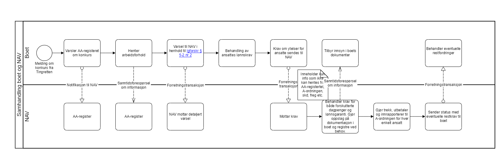

= Steg 2 - Identifisere samhandlingsmønstre

Som del av modellering av digital samhandlingsprosess, se link:./Steg 1.adoc[steg 1], så er det naturlig å identifisere hvilket link:./Samhandlingsmønstre.adoc[samhandlingsmønster] som gjelder for hver enkelt samhandling.

Rett samhandlingsmønster identifiseres best gjennom å forstå behovet for hver enkelt samhandling. Det er viktig at begge partene prater gjennom prosessen sammen, slik at man får en felles forståelse av behov, slik at man kan enes om mønster.

Prosessen for samtykkebasert lånesøknad kan for eksempel da modelleres slik:

image:./images/Prosess SBL med angivelse av mønster[alt="bad!", width=750]

Prosessen for konkurs og lønnsgaranti kan for eksempel modelleres slik:

Når samhandlingsmønster er identifisert for hver enkelt samhandling, så blir neste steg å mappe mønster til referansearkitektur, se link:./Steg 3.adoc[steg 3].

