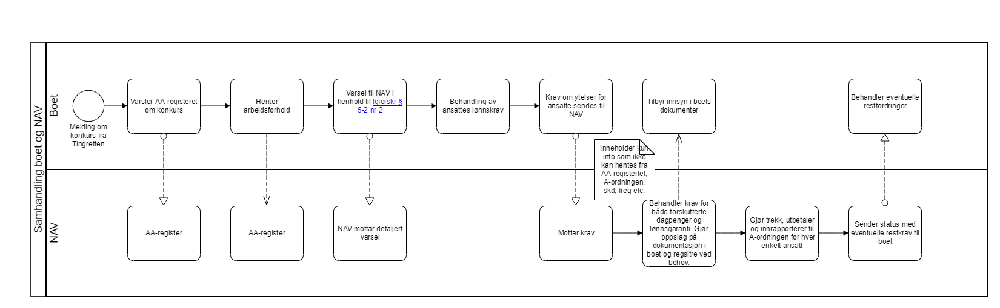

= Steg 1 - Modeller fulldigitaliserte forretningsprosesser med fokus på samhandling

Basert på god forståelse av prosessene for fulldigitalisert samhandling mellom virksomheter og virksomhetenes rolle/ ansvar i disse prosessen har man mulighet for å gjøre gode tekniske løsningsvalg på digital samhandling. Her beskrives hvordan man kan ta fram slike prosesser som først og fremst har fokus på den digitale samhandlingen.

Digital samhandling mellom virksomheter vil fra et forretningsperspektiv gjøres på et fåtall måter. Dette kaller vi link:./Samhandlingsmønstre.adoc[samhandlingsmønstre]. I link:./Steg2.adoc[steg 2] vil vi se på hvordan vi enkelt kan avdekke hvilke samhandlingsmønstre man har behov for å realisere en digital samhandlingsprosess og deretter mappe disse mor referansearkitekturer i link:./Steg3.adoc[steg 3]. Først når man har identifisert samhandlingsmønstre og referansearkitektur, er det riktig å diskutere løsningsarkitektur og hvilke tekniske løsningsalternativer man har for hver enkelt samhandling. Dette ser vi på i link:./Steg4.adoc[steg 4]. Sagt på en annen måte, man må forstå og være enige om behovet før man kan diskutere teknologi.

Ved modellering av forretningsprosesser på tvers av virksomheter, skal man tydelig avklare både eierskap til informasjon og funksjonalitet. Man skal deretter (eller i paralell) tenke på hvordan en fulldigitalisert prosess grovt sett se ut hos hver enkelt part. Før man til slutt (eller i paralell) ser på hvordan samhandlingen burde fungert dersom begge parter blir fulldigitalisert på området man jobber med. Man bør prøve å forstå hvilke behov som styrer en hver samhandling, for eksempel:

* Hente data der og da
* Varsle om en tilstandsendring (noe har skjedd)
* Overlevere ansvaret for videre behandling til annen part
* Oppdatere noe hos annen part
* Etc.

Det er avgjørende at hjemler/samtykke for deling av informasjon er på plass slik at prosessen kan digitaliseres. Dersom det er behov for endringer i lovverk (juridisk samhandlingsevne), så må dette initieres mot rett lovgivende departement. Dersom det dukker opp nye sentrale begreper, så bør disse løftes inn i begrepskatalogen (semantisk samhandlingsevne). Gjennom å jobbe med digital prosess for samhandling tidlig, så vil man kunne avdekke behov knyttet til samhandlingsevne på de forskjellige interoperabilitetsnivåene.

Forretningsprosessens hovedformål er å identifisere digitale samhandlinger på tvers av virksomheter og ikke vise detaljer på hva som foregår i den enkelte virksomhet. Dette for å ha fokus på den digitale samhandlingen. Her følger noen eksempler på hvordan man kan modellere digital samhandling.

Prosessen for samtykkebasert lånesøknad kan for eksempel modelleres slik:

image:./images/Prosess SBL.png[alt="bad!", width=750]

Prosessen for konkurs og lønnsgaranti kan for eksempel modelleres slik:

Når 2 parter blir enige om en fulldigitalisert prosess, så har man et godt startpunkt på videre arbeid. Begge parter må kanskje gjøre løft i forhold til digitalisering, noe som ikke alltid er fullt ut mulig. Ofte vil man kunne digitalisere samhandlingen for fremtiden og så kan hver og en virksomhet stegvis dra nytte av dette til å digitalisere interne løsninger. Unntaksvis må man kanskje fire på kravet på hvor langt man vil gå i å digitalisere samhandlingen. I link:./Steg2.adoc[steg 2] vil vi se på hvordan man mapper fra en digital prosess ned på forretningsmønstre. link:./Steg2.adoc[steg 2] kan med fordel kjøres samtidig som steg 1, men er av pedagogiske grunner dokumentert separat.
